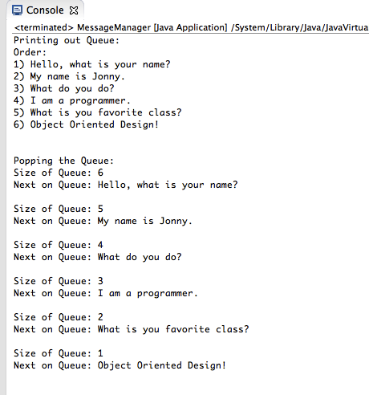

Message-Queue
=============

Java Message Queue using Vectors.

CLASS DEFINITIONS
------------------

-MessageQueue.jaja - Provides the framework for a queue that takes in a 'Message' object

-Message.java - The message abstract class. Basically a wrapper for a string. This is the base class for QueryMsg and ReplyMsg classes.

-QueryMsg / ReplyMsg.java - These are classes of type message. For brevity, these two classes are almost identical. However, the point is that MessageQuery can accept any class that is of 'Message' type.

-MessageManager.java - Main method class. Provides a quick test of the queue.

SCREENSHOTS:
-------------

